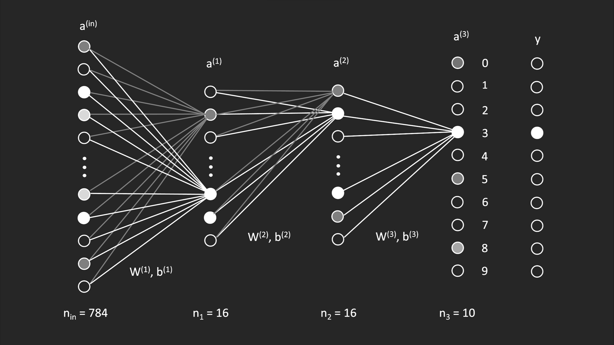
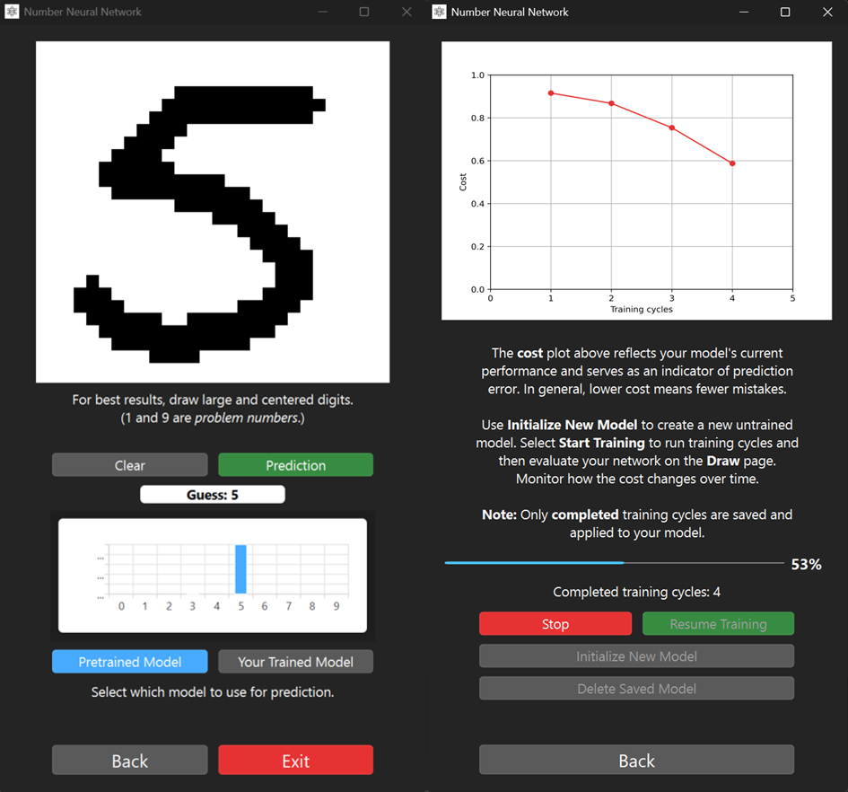
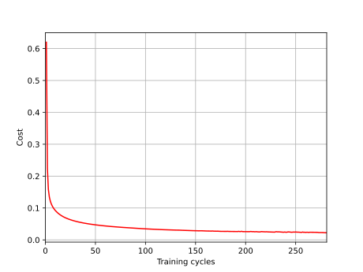

# Number Neural Network

[](https://github.com/luniphys/number-neuralnetwork/actions/workflows/ci.yml)
[](https://www.python.org/)
[](LICENSE)

A handwritten digit recognizer built from scratch in Python using the MNIST dataset.

The project implements forward propagation, backpropagation, training, and evaluation without machine learning frameworks (no TensorFlow, PyTorch, etc.). A PyQt6 GUI is included for interactive drawing and prediction.

<p align="center">
    
</p>

## Table of Contents

- [Overview](#overview)
- [Features](#features)
- [Project Structure](#project-structure)
- [Getting Started](#getting-started)
- [Usage](#usage)
- [Results](#results)
- [Mathematics](#mathematics)
- [Testing](#testing)
- [Acknowledgments](#acknowledgments)
- [License](#license)

## Overview

This repository demonstrates a compact, educational neural network for digit classification:

- Input: MNIST grayscale images (28 x 28 pixels, represented by 784 input neurons)
- Architecture: 784 -> 16 -> 16 -> 10
- Activation: sigmoid
- Loss: squared error
- Training: self-implemented custom gradient-based backpropagation

## Features

- Implementation in plain Python and NumPy
- Automatic MNIST data download when required
- GUI based training workflow backed by reusable training logic
- Training and evaluation scripts
- Interactive PyQt6 app with possibilities to draw digits and view output probabilities, and training a fresh model
- Saved model weights and biases for a pre-trained state

## GUI

<p align="center">
    
</p>

## Project Structure

```text
src/neuralnetwork/
|- training.py      # Network setup + training with backpropagation on MNIST training data (used by GUI)
|- evaluation.py    # Accuracy and cost evaluation on MNIST test data
|- gui.py           # GUI application: drawing, prediction, and training controls
|- paths.py         # Centralized path definitions
```

## Getting Started

### Prerequisites

- Python 3.8+
- pip

### Installation

From the project root:

```bash
pip install -r requirements.txt
```

## Usage

Run all commands from the repository root.

### Launch GUI

```bash
python src/neuralnetwork/gui.py
```

Draw a digit on the canvas and the model will output predicted probabilities for the digits 0-9. Train a fresh model and see its prediction improvements.

### Train a Model

```bash
python src/neuralnetwork/training.py
```

Training can also happen inside the GUI application, where `training.py` acts as the backend engine.


Notes:

- If MNIST is missing, it is downloaded automatically.
- Training from scratch is computationally expensive and can take many hours depending on hardware.
- In the GUI the models are trained by <b>MNIST</b> test data, in `training.py` by <b>MNIST</b> training data which is 6 times bigger. Therefore GUI is significantly faster. 

### Evaluate a Trained Model

```bash
python src/neuralnetwork/evaluation.py
```

This reports average cost, total misclassifications, and accuracy on the <b>MNIST</b> test data. On top a random sample is shown more in detail.

## Results

The included pre-trained model, reaches approximately 94.84% accuracy after 281 training cycles (about 60 hours total training time).

<p align="center">
    
</p>

## Mathematics

The network computes each layer activation as:

$$
a^{(n)} = \sigma \left( W^{(n)} a^{(n-1)} + b^{(n)} \right), \quad n = 1,2,3
$$

with sigmoid activation:

$$
\sigma(x) = \frac{1}{1 + e^{-x}}
$$

The objective is to minimize the squared error:

$$
C = \sum_{k=1}^{n_3} \left(a_k^{(3)} - y_k\right)^2
$$

where $y$ is the one-hot encoded target vector for the true digit.

To minimize $C$, the implementation uses the following gradients (with $\sigma$ as sigmoid):

$$
\frac{\partial C}{\partial w_{ij}^{(3)}} = 2 \left(a_i^{(3)} - y_i \right) \cdot \sigma^{\prime} \left(z_i^{(3)} \right) \cdot a_j^{(2)}
$$

$$
\frac{\partial C}{\partial b_{i}^{(3)}} = 2 \left(a_i^{(3)} - y_i \right) \cdot \sigma^{\prime} \left(z_i^{(3)} \right)
$$

$$
\frac{\partial C}{\partial w_{ij}^{(2)}} = \sigma^{\prime} \left(z_i^{(2)} \right) \cdot a_j^{(1)} \cdot \sum_{k=1}^{n_3} 2 \left(a_k^{(3)} - y_k \right) \cdot \sigma^{\prime} \left(z_k^{(3)} \right) \cdot w_{ki}^{(3)}
$$

$$
\frac{\partial C}{\partial b_{i}^{(2)}} = \sigma^{\prime} \left(z_i^{(2)} \right) \cdot \sum_{k=1}^{n_3} 2 \left(a_k^{(3)} - y_k \right) \cdot \sigma^{\prime} \left(z_k^{(3)} \right) \cdot w_{ki}^{(3)}
$$

$$
\frac{\partial C}{\partial w_{ij}^{(1)}} = \sigma^{\prime} \left(z_i^{(1)} \right) \cdot a_j^{(\text{in})} \cdot \sum_{k=1}^{n_3} 2 \left(a_k^{(3)} - y_k \right) \cdot \sigma^{\prime} \left(z_k^{(3)} \right) \cdot \sum_{l=1}^{n_2} w_{kl}^{(3)} \cdot \sigma^{\prime} \left(z_l^{(2)} \right) \cdot w_{li}^{(2)}
$$

$$
\frac{\partial C}{\partial b_{i}^{(1)}} = \sigma^{\prime} \left(z_i^{(1)} \right) \cdot \sum_{k=1}^{n_3} 2 \left(a_k^{(3)} - y_k \right) \cdot \sigma^{\prime} \left(z_k^{(3)} \right) \cdot \sum_{l=1}^{n_2} w_{kl}^{(3)} \cdot \sigma^{\prime} \left(z_l^{(2)} \right) \cdot w_{li}^{(2)}
$$

## Testing

Install test dependency:

```bash
pip install pytest
```

Run tests:

```bash
pytest
```

## Acknowledgments

The mathematical intuition and learning approach are inspired by the excellent 3Blue1Brown neural network series:

https://www.youtube.com/playlist?list=PLZHQObOWTQDNU6R1_67000Dx_ZCJB-3pi

## License

This project is licensed under the MIT License. See [LICENSE](LICENSE) for details.
